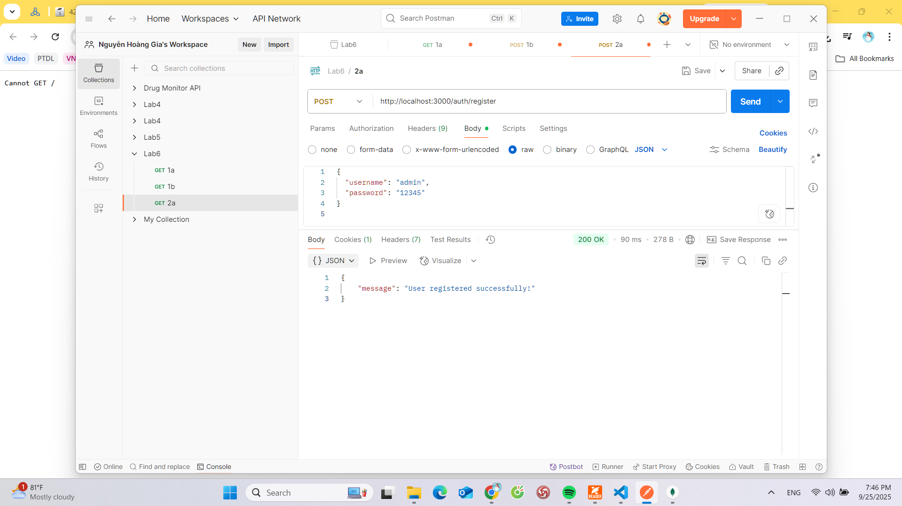
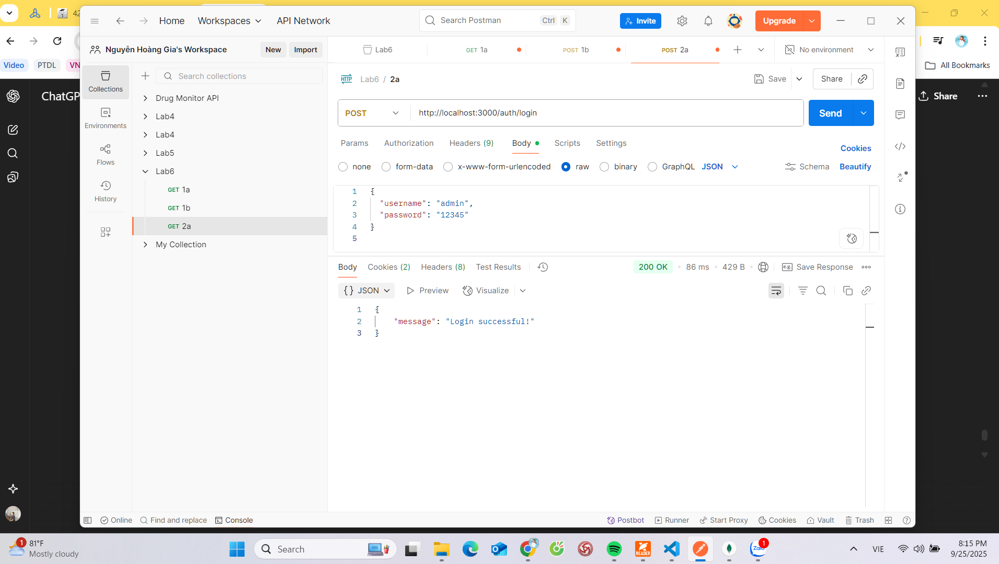
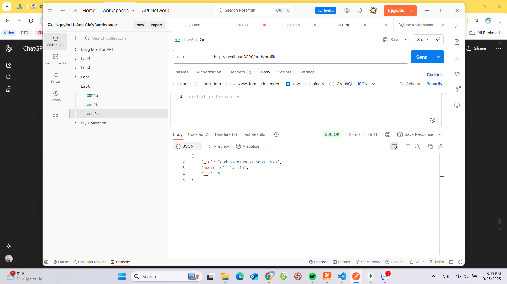
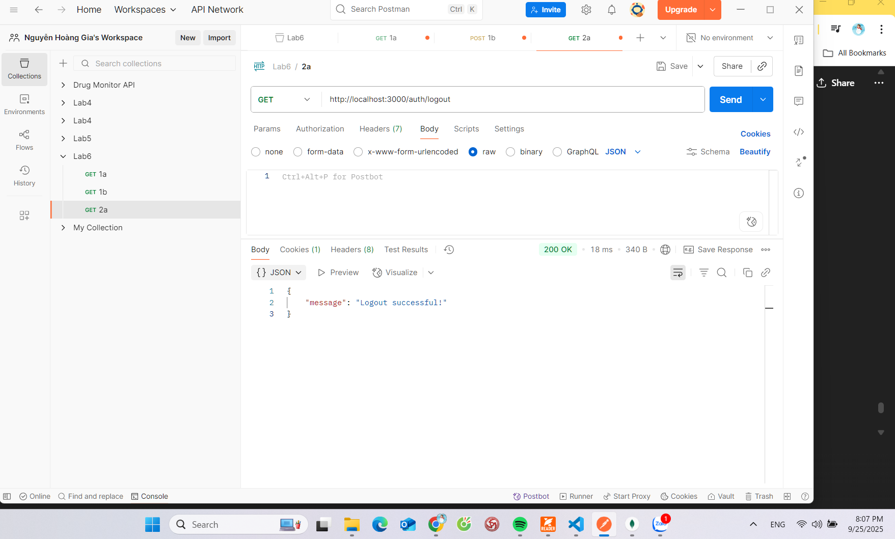
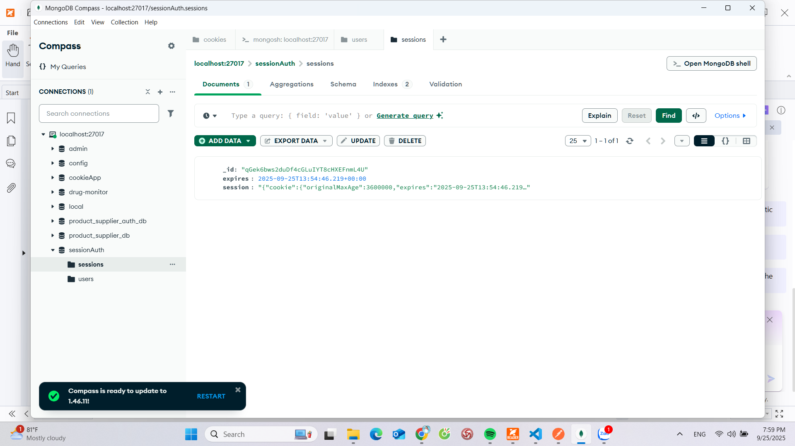

# Cookie Session Authentication

This project demonstrates how to implement authentication using **Express.js**, **express-session**, and **MongoDB (connect-mongo)**.  
It covers user registration, login with session cookies, accessing protected routes, and logout.

---

## 1. Setup

### Install dependencies
```bash
npm install
Run server
bash
Copy code
node app.js
Server will run on:
👉 http://localhost:3000

2. API Testing with Postman
We use Postman to test all APIs.
After each request, a session cookie (connect.sid) will be stored in MongoDB and also sent back to the client.

a. Register a new user
Endpoint: POST /auth/register

Body (JSON):

json
Copy code
{
  "username": "admin",
  "password": "12345"
}
Expected result: User registered successfully.

📷 Result screenshot here:


b. Login
Endpoint: POST /auth/login

Body (JSON):

json
Copy code
{
  "username": "admin",
  "password": "12345"
}
Expected result: Login successful and connect.sid cookie set.

📷 Result screenshot here:


c. Go to Profile (Protected route)
Endpoint: GET /auth/profile

Requirement: Must include session cookie (connect.sid) from login.

Expected result: Return user info (without password).

📷 Result screenshot here:


d. Logout
Endpoint: GET /auth/logout

Expected result: Session destroyed, cookie cleared.

📷 Result screenshot here:


e. Check Cookie Deleted in Database
After logout, verify in MongoDB that the session document was deleted from the sessions collection.

📷 Result screenshot here:


3. Notes
Default session cookie name: connect.sid

Cookies are stored both in client (browser/Postman) and in MongoDB.

Sessions expire automatically after 1 hour (configurable in app.js).